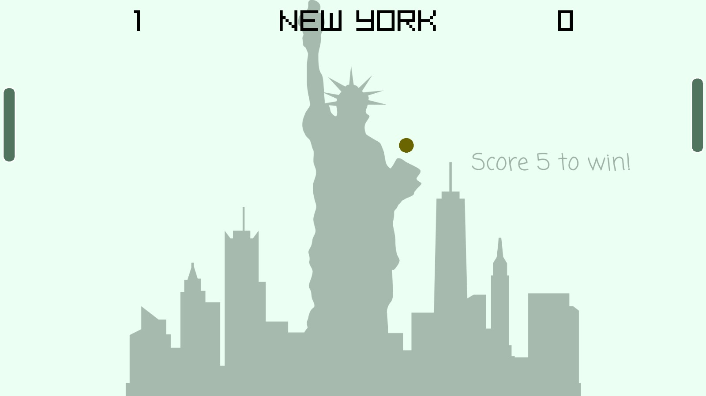

# **CapTale: Every Move Counts**

**Group Members**

- [Ismail Silat — 24K-0546 (Leader)](https://github.com/ismailsilat7)  
- [Ali Kashif — 24K-0802](https://github.com/ali5917)  
- [Hammad Abdul Rahim — 24K-0581](https://github.com/hammadrahim-06)

## **Table of Contents**

- [Executive Summary](#executive-summary)
- [Introduction](#introduction)
- [Project Description](#project-description)
  - [Scope](#scope)
  - [Technical Overview](#technical-overview)
- [Methodology](#methodology)
  - [Roles and Responsibilities](#roles-and-responsibilities)
- [Project Implementation](#project-implementation)
  - [Functionalities Developed](#functionalities-developed)
  - [Challenges Faced](#challenges-faced)
- [Results](#results)
  - [Screenshots and Illustrations](#screenshots-and-illustrations)
- [Testing and Validation](#testing-and-validation)
- [Conclusion](#conclusion)
- [File Structure](#file-structure)

## **Executive Summary**

### Overview

CapTale is a modular, object-oriented 2D world-style game developed in C++ using the Raylib library. It consists of multiple interconnected mini-games called "cities," each offering a different gameplay experience. The project focuses on applying Object-Oriented Programming (OOP) concepts such as encapsulation, inheritance, and modularity to manage complexity and promote code reuse.

### Key Highlights

- Successfully applied OOP principles: encapsulation, inheritance, abstraction, modular design.
- Implemented token and energy systems to simulate in-game resource management.
- Developed a working game featuring seven diverse cities.

## **Introduction**

### Background

Many beginner-level games lack maintainability and modularity. CapTale addresses this issue by applying structured OOP design, where each city is encapsulated as a class. This reinforces core programming principles while building a playable game.

### Project Objectives

- Build an interactive 2D game in C++ using Raylib.
- Apply OOP concepts to structure and modularize code.
- Implement diverse, city-based gameplay.
- Integrate resource systems (tokens and energy).
- Include pause functionality and a customizable player character.

## **Project Description**

### Scope

**Inclusions:**

- Customizable "Cap" character with 8-directional movement.
- Seven cities:
  - Pong City (3 difficulty levels: Karachi, New York, Rome)
  - Shooter City (spaceship shooting game)
  - Car City (coin collecting and obstacle avoidance)
  - Energy City (refill energy via fruit-catching game)
  - Earning City (math questions to earn tokens)
  - ATM City (deposit/withdraw tokens)
  - Custom City (character customization)
- Pause feature (Pong City)
- Resource management: energy and tokens

**Exclusions:**

- Multiplayer support  
- Advanced AI/animations  
- Mobile/web ports

### Technical Overview

- **Language:** C++  
- **Library:** Raylib  
- **Editor:** Visual Studio Code  
- **Assets:** Canva Pro (for character/background design)

## **Methodology**

### Approach

The development followed an agile, iterative approach. Each city and core system was built and tested incrementally to ensure smooth integration and bug-free gameplay.

### Roles and Responsibilities

- **[Ismail Silat](https://github.com/ismailsilat7) :** Shooter City, Earning City, Energy City, ATM logic, Lobby mechanics, UI messaging, Character save/load  
- **[Ali Kashif](https://github.com/ali5917) :** Game structure, Pong City, ATM City, Custom City, fruit logic, pause mechanics, Info section  
- **[Hammad Abdul Rahim](https://github.com/hammadrahim-06) :** Car City, token system logic, UI design and screen layouts

## **Project Implementation**

### Design and Structure

- Object-oriented class architecture
- Each city encapsulated in its own class
- Cap class for player movement and customization
- Main loop manages transitions between cities

### Functionalities Developed

- Modular city-based navigation
- Cap character customization
- Pong game with AI and levels
- Shooter, car, and quiz mini-games
- Pause functionality (in Pong City)
- Token/energy tracking systems
- Quiz-based token earning
- ATM transaction interface

### Challenges Faced

- Seamless city transitions
- Input conflicts in pause and city switching
- Code merging while developing in parallel
- Learning curve with Raylib (input, drawing, sound)

## **Results**

### Project Outcomes

- Fully functional, playable game
- Seven modular city games
- Token and energy systems integrated
- Strong application of OOP principles

## **Screenshots and Illustrations**

### Lobby and Navigation

- 8-directional movement  
- Room transitions  
- UI indicators (energy, tokens)  

### Custom City  
- Cap customization interface
- Color/character options preview

### Pong City  
- Pong gameplay for Karachi, New York, and Rome difficulty levels
- Pause screen functionality
  
  
  

### Shooter City  
- Space shooter interface
- Shooting mechanics and enemy sprites
  
  

### Car City  
- Coin collection and obstacle avoidance
- Speed changes, power ups and game-over screen
  
  

### Energy City  
- Fruit-catching gameplay
- Energy refill animation and bar update

### Earning City  
- Math question prompt UI
- Correct/Incorrect feedback and reward screen
  
  

### ATM City  
- Token/cash transaction interface
- UI messages for success/failure
  
  

### Game Over  
- Screen after cap dies

## **Testing and Validation**

- Manual testing at each development stage
- Debugging and optimization for each city
- Edge cases like no energy/tokens handled with appropriate UI messages

## **Conclusion**

### Summary of Findings

CapTale effectively applied C++ OOP principles in a playable 2D world. Its modular structure enabled collaboration and parallel development. Each city maintained independence while contributing to a unified gameplay experience.

### Final Remarks

The project was a meaningful learning experience, especially in design, coordination, and integrating logic across modules. It boosted our programming confidence and teamwork skills.

## **File Structure**

<strong>main</strong>

- [main.cpp](./main.cpp)  
- [README.md](./README.md)  

<strong>headers</strong>

- [atmCity.h](./headers/atmCity.h)  
- [cap.h](./headers/cap.h)  
- [carCity.h](./headers/carCity.h)  
- [customCity.h](./headers/customCity.h)  
- [custom_timer.h](./headers/custom_timer.h)  
- [earningCity.h](./headers/earningCity.h)  
- [energyCity.h](./headers/energyCity.h)  
- [lobby.h](./headers/lobby.h)  
- [message.h](./headers/message.h)  
- [pongCity.h](./headers/pongCity.h)  
- [settings.h](./headers/settings.h)  
- [spaceShooter.h](./headers/spaceShooter.h)  
- [spaceShooterSettings.h](./headers/spaceShooterSettings.h)  
- [sprites.h](./headers/sprites.h)  

<strong>assets</strong>

- [atmCity](./assets/atmCity)  
- [carCity](./assets/carCity)  
- [customCity](./assets/customCity)  
- [earnCity](./assets/earnCity)  
- [energyCity](./assets/energyCity)  
- [fonts](./assets/fonts)  
- [gameOver](./assets/gameOver)  
- [lobby](./assets/lobby)  
- [pongCity](./assets/pongCity)  
- [screenshots](./assets/screenshots)  
- [spaceShooter](./assets/spaceShooter)  

